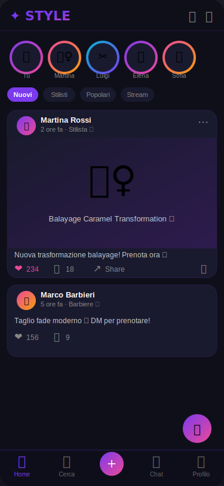
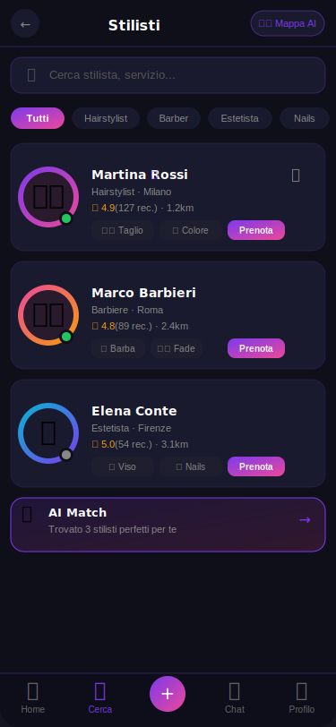
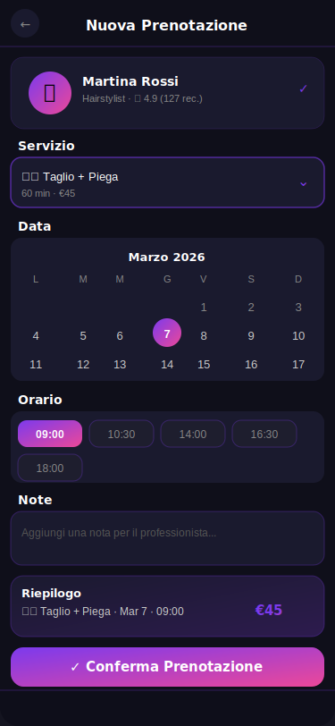
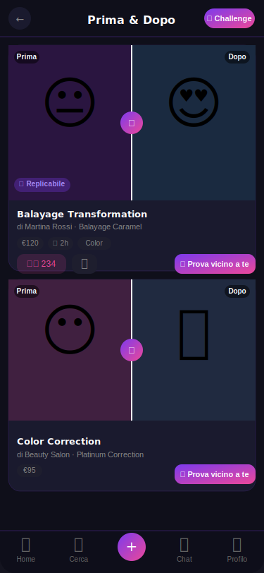
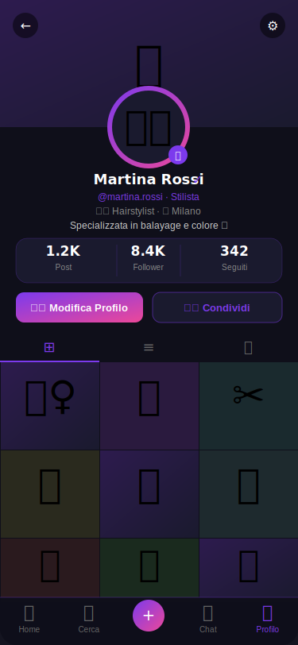

# 💇 STYLE - La Piattaforma Beauty Completa

**Versione:** 1.0.0 | **Stack:** React 18 + Vite + TypeScript + Tailwind CSS + Supabase

---

## 📸 Screenshot

<p align="center">
  
  &nbsp;&nbsp;
  
  &nbsp;&nbsp;
  
  &nbsp;&nbsp;
  
  &nbsp;&nbsp;
  
</p>

| Home Feed | Stilisti | Prenotazione | Prima & Dopo | Profilo |
|:---------:|:--------:|:------------:|:------------:|:-------:|
| Feed social con storie, post e live | Cerca e prenota professionisti | Selezione data, orario e servizio | Gallery trasformazioni interattiva | Portfolio, statistiche e impostazioni |

---

## ✨ Funzionalità

### Core
- ✅ Autenticazione multi-ruolo (Cliente / Professionista / Business)
- ✅ Autenticazione tramite numero di telefono (OTP SMS, stile WhatsApp)
- ✅ Feed social con like, commenti, condivisioni
- ✅ Sistema Follow / Unfollow in tempo reale
- ✅ Notifiche real-time e push (anche ad app chiusa, via Service Worker)
- ✅ Chat stile Messenger/WhatsApp con messaggi vocali e traduzione in tempo reale
- ✅ Prenotazioni con selezione data, orario e luogo
- ✅ Profilo modificabile con avatar upload

### Tema Dark / Light
- ✅ Switch globale Dark/Light direttamente nell'header della home
- ✅ Il tema viene salvato e ripristinato automaticamente tra le sessioni
- ✅ Tema scuro (nero, default) e chiaro (bianco, stile Instagram)
- ✅ Controllo vocale del tema: "tema chiaro" / "tema scuro"

### Stella AI – Assistente vocale
- ✅ Comandi vocali stile Alexa: esecuzione automatica di azioni in-app
- ✅ Wake word: dì "Stella" per attivare l'assistente
- ✅ Comandi supportati:
  - `"vai alla home"`, `"apri chat"`, `"apri mappa"`, `"prenota"`, `"apri shop"`
  - `"invia messaggio a [nome]: [testo]"` – invia un messaggio con contenuto specificato
  - `"metti like"` / `"dai like"` – interazione rapida
  - `"cerca match a [N] km"` – ricerca sulla mappa intelligente
  - `"tema chiaro"` / `"tema scuro"` – cambio tema vocale
  - `"dimmi le notifiche"`, `"conferma prenotazione"`, `"aggiungi [nome]"`, e molti altri

### Chat avanzata
- ✅ Chat stile Messenger/WhatsApp con messaggi testuali, immagini, file, vocali
- ✅ Traduzione in tempo reale dei messaggi in arrivo (rileva lingua automaticamente)
- ✅ Chiamate vocali e video in-app
- ✅ Registrazione messaggi vocali con Media Recorder API

### Notifiche Push
- ✅ Notifiche push attive anche ad app chiusa tramite Service Worker
- ✅ Notifiche stile social: like, commenti, messaggi, prenotazioni, follower
- ✅ Click sulla notifica apre direttamente il contenuto rilevante

### Business & HR
- ✅ Dashboard Business con analytics
- ✅ Gestione annunci di lavoro (HR)
- ✅ Profilo Business con servizi, shop e recensioni

### Entertainment & Gamification
- ✅ Live Streaming con reactions, chat e tips (QRCoin)
- ✅ Radio & Music Player integrato
- ✅ Spin & Win, Challenges, Leaderboard
- ✅ Sistema QRCoin e Programma referral

### E-commerce & Altro
- ✅ Shop prodotti beauty
- ✅ Dettaglio servizi con prenotazione diretta
- ✅ Before/After gallery, Eventi, PWA installabile
- ✅ Impostazioni utente, Recensioni, Ricerca su mappa intelligente AI

---

## 🚀 Sviluppo locale

```bash
npm install
npm run dev        # avvia il server di sviluppo su http://localhost:8080
```

---

## 🧪 Test

### Eseguire i test in locale

```bash
npm test           # esegui tutti i test una sola volta
npm run test:watch # esegui i test in modalità watch (rieseguiti ad ogni modifica)
```

Test inclusi:
- `useTheme.test.ts` – default theme, localStorage restore, toggle, CSS variables
- `voiceCommands.test.ts` – pattern matching comandi vocali (navigazione, messaggi, like, mappa, tema)

### CI automatica

Ogni push o Pull Request verso `main` esegue automaticamente lint e test tramite il workflow **CI – Lint & Test** (`.github/workflows/ci.yml`).

---

## 📱 Autenticazione telefono (OTP)

Per abilitare l'autenticazione tramite numero di telefono (stile WhatsApp):

1. Nel [pannello Supabase](https://app.supabase.com) → **Authentication → Providers** → abilita **Phone**
2. Configura un provider SMS (Twilio, MessageBird, ecc.) nelle impostazioni Supabase
3. L'utente inserisce il numero (es. `+39 333 123 4567`) → riceve un OTP via SMS → accede

---

## 📦 Pubblicare l'app

### 🌐 Web – GitHub Pages

Il workflow **Deploy – GitHub Pages** (`.github/workflows/deploy.yml`) si attiva automaticamente ad ogni push su `main` e pubblica il build su GitHub Pages.

**Setup una tantum:**
1. Vai su **Settings → Pages** del repository
2. In *Source* seleziona **GitHub Actions**
3. Aggiungi i seguenti segreti in **Settings → Secrets and variables → Actions**:
   - `VITE_SUPABASE_URL`
   - `VITE_SUPABASE_PUBLISHABLE_KEY`
   - `VITE_SUPABASE_PROJECT_ID`
4. Il sito sarà disponibile all'URL mostrato nel tab *Pages* (es. `https://<utente>.github.io/beauty-style-pro/`)

Per testare il build web in locale:

```bash
npm run build      # genera la cartella dist/
npm run preview    # anteprima locale del build su http://localhost:4173
```

### 🤖 Android – Google Play (AAB)

Il workflow **Build & Publish Android to Play Store** (`.github/workflows/android.yml`) genera un bundle `.aab` firmato e lo pubblica automaticamente sul Play Store (internal testing track).

**Setup una tantum:**
1. Genera un keystore di firma:
   ```bash
   keytool -genkey -v -keystore stayle.keystore -alias style-beauty \
     -keyalg RSA -keysize 2048 -validity 10000
   ```
2. Converti il keystore in Base64:
   ```bash
   base64 stayle.keystore | tr -d '\n'
   ```
3. Aggiungi i segreti in **Settings → Secrets and variables → Actions**:

   | Secret | Descrizione |
   |---|---|
   | `ANDROID_KEYSTORE_BASE64` | Keystore in Base64 |
   | `ANDROID_KEY_ALIAS` | Alias chiave (es. `style-beauty`) |
   | `ANDROID_STORE_PASSWORD` | Password keystore |
   | `ANDROID_KEY_PASSWORD` | Password chiave |
   | `GOOGLE_PLAY_SERVICE_ACCOUNT_JSON` | JSON del Service Account Google Play (per la pubblicazione automatica) |

4. Per il Service Account Google Play: vai su Google Play Console → Setup → API access → crea un account di servizio con ruolo *Release manager*
5. Se `GOOGLE_PLAY_SERVICE_ACCOUNT_JSON` non è impostato, il workflow salva l'AAB come artefatto scaricabile (skip silenzioso della pubblicazione)
6. Per cambiare track (`internal` → `alpha` / `beta` / `production`), modifica il campo `track:` in `.github/workflows/android.yml`

---

## 🔗 Connessione GitHub

Sì, **questo repository è connesso a GitHub** ed è possibile apportare modifiche tramite:

- **[Lovable.dev](https://lovable.dev)** – modifiche visive e AI direttamente sincronizzate sul repository tramite commit automatici
- **GitHub Copilot Agent** – modifiche automatizzate tramite agenti AI GitHub (pull request automatiche)
- **Pull Request classica** – contributi diretti creando un branch e aprendo una PR su `main`

Ogni modifica su `main` attiva automaticamente:

| Workflow | File | Azione |
|---|---|---|
| CI – Lint & Test | `.github/workflows/ci.yml` | Esegue lint e test su ogni push e PR |
| Deploy – GitHub Pages | `.github/workflows/deploy.yml` | Pubblica l'app su GitHub Pages |
| Build & Publish Android | `.github/workflows/android.yml` | Genera e pubblica l'AAB sul Play Store |

---

Creato con [Lovable](https://lovable.dev)
